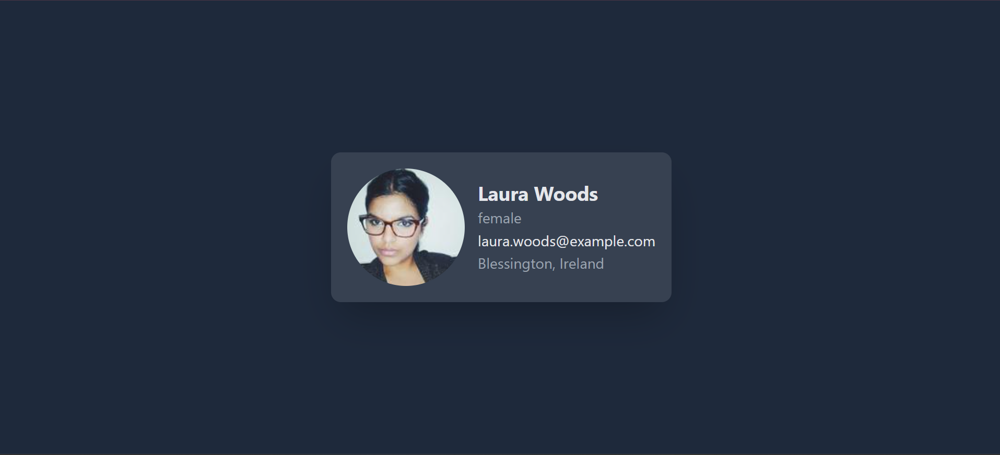

# Random User Profile App

This is a simple React application that fetches a random user profile from the Random User Generator API and displays it in a card format as shown in the provided design.

## Functionality

- Fetches a random user profile from the Random User Generator API.
- Displays the user profile in a card format with the user's name, email, city, and country.
- Utilizes proper CSS styling to present the user profile card in a visually appealing manner.

## Screenshot



## Prerequisites

- Node.js installed on your machine. You can download it from [here](https://nodejs.org/).

## Installation

1. Clone the repository:
   ```bash
   git clone https://github.com/zeeshan-akhter/user-card-app/
   ```
2. Change into the project directory:

   ```bash
   cd user-card-app
   ```

3. Install dependencies:
   ```bash
   npm install
   ```

## Usage

1. Start the development server:

   ```bash
   npm start
   ```

2. Open your web browser and visit `http://localhost:3000` to view the application.

## Dependencies

- `axios`: For making HTTP requests to fetch user data from the API.
- `react`: JavaScript library for building user interfaces.
- `react-dom`: React package for working with the DOM.
- `react-scripts`: React scripts and configurations for building and running the application.

## Folder Structure

- `public`: Contains the public assets and the HTML file where the React app is rendered.
- `src`: Contains the source code of the React application.
  - `components`: Contains React components, including the `Card` component.
  - `App.js`: Main entry point of the application.
  - `index.js`: Entry point for React rendering.

## API Used

- [Random User Generator API](https://randomuser.me/): Used to fetch random user profiles.

## Additional Notes

- This application was bootstrapped using `create-react-app`.
- Proper error handling and loading states can be added for a better user experience.
- Styling is implemented using Tailwind CSS, a utility-first CSS framework. Ensure proper setup of Tailwind CSS in your project for the styles to work correctly.
